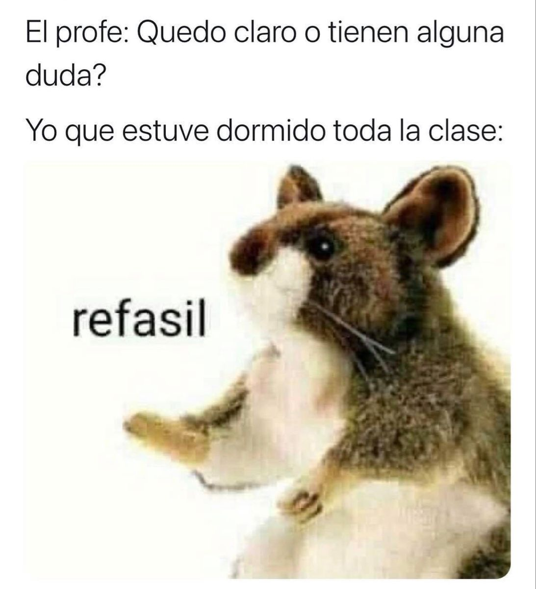

# Estadistica II
Repositorio github del curso Estadística 2 por Matheo Muñoz

En este repositorio encontrarás los talleres del curso que serán dictados a lo largo del semestre 2023-2 en las monitorías. Aquí les estaré dejando también distintos links de interés, algunos de ellos es para aquellos que les vaya llamando la atención aprender más sobre la estadística y  modelos de regresión. Esto es pues la variedad de carreras que cogen el curso es alta y algunos lo hacen con el propósito de tener bases en su camino de aprendizaje de machine learning, también a algunos les gusta más la programación que a otros, por lo que las herramientas necesarias para aplicar lo que aprenden en el curso en su ordenador se las daré a lo largo del semestre. :boom:

## Importante

En los talleres se aclarará absolutamente todo lo necesario para los temas para el parcial además de que se les dará un taller de repaso para cada parcial cuya grabación dependerá de la asistencia y estará disponible hasta el día antes del exámen a media noche :3. También se les dará asesoría con el primer trabajo ya que es el más exigente de los 2 y en asesoría podrán resolver cualquier duda que tengan del curso puntual o general del tipo: "No entendí la primera semana de clases, ¿podrías explicarme?". En un caso así también se dejará grabación para revisión de los demás.

Horario taller presencial:

Horario taller virtual:

Horario asesorías virtuales:

## Links :exclamation:

-[Link meet]() taller virtual. :art:

-[Link meet]() asesoría virtual. :package:

-[Aquí](https://cran.r-project.org/bin/windows/base/old/) podrán descargar cualquier versión de R que deseen, sin embargo **no lo más nuevo es mejor**, en lo personal usaré la versión 4.2.3 puesto que es la más estable con todos los paquetes necesarios para el curso (particularmente tidyverse, se dará cuenta de esto si utiliza conda), si en algún punto les salen errores de compatibilidad es probable que sea por usar la versión más reciente (4.3.1) con paquetes que aún no han sido actualizados así que versón 4.2.3 hacia abajo es ir a la segura. :ok_hand:

-Además de usar R, que es el lenguaje de programación, usaremos el entorno de edición de código [RStudio](https://posit.co/download/rstudio-desktop/) que facilitará muchas cosas a la hora de programar. :kissing:

-Si no les gusta instalar cosas en su pc también pueden utilizar el entorno [RStudio en la nube](https://login.rstudio.cloud/login?redirect=%2F) que aparte les funcionará al 100%, por lo que no les generará errores con paquetes ni nada de eso. En lo personal prefiero la experiencia de usuario por fuera del browser pero ajá. :sleeping:

-Les dejo por acá un libro excelente de [programación R](https://fhernanb.github.io/Manual-de-R/) escrito por el profesor de la facultad de ciencias Freddy Hernández. :alien:

-Y este lo pueden tomar como el [libro guía del curso en R](https://fhernanb.github.io/libro_regresion/) escrito por el mismo profesor. :star:

-[Link drive](https://drive.google.com/drive/folders/1PEZPU11apww2Hh52lmKklUcHCxLMqGLJ?usp=share_link) con grabación de talleres.

-[Link drive](https://drive.google.com/drive/folders/1uI6ra1NUOFCoCKtKOmuLgRevUdBfY8ci?usp=share_link) con los pdf de las clases profesor Carlos Mario.

Adicional a esto instalen el paquete *tidyverse* en su R, en el taller no.1 podrán ver cómo lo hacen.

