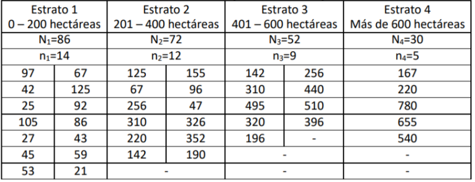
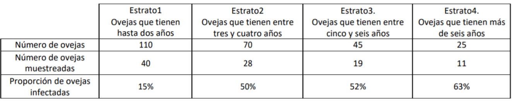

---
header-includes:
- \usepackage{float}
- \usepackage[utf8]{inputenc}
- \usepackage[spanish, es-tabla]{babel}\decimalpoint
output:
  pdf_document: default
  html_document: default
fontsize: 12pt
papersize: letter
geometry: margin = 1in
language: "es"
---

```{r setup, include=FALSE}
knitr::opts_chunk$set(echo = F, comment = NA)
library(knitr)
library(kableExtra)
library(tidyverse)
```


**Estadística II - Taller 10$\hspace{1.6cm}$Semestre: 2023-01**

**Profesores: Francisco Javier Rodríguez Cortés, Julieth Verónica Guarín Escudero**

**Monitor: Matheo Muñoz Betancur**

$\rule{6.5in}{1pt}$

\textbf{Responda las preguntas de 1 a 3 apoyado en la siguiente información}

Un guardabosque quiere estimar el número promedio de hectáreas plantadas de árboles en los ranchos de un estado. Ya que el número de hectáreas de árboles varía considerablemente con respecto al tamaño del rancho, decide estratificar con base en el tamaño de los ranchos. Los 240 ranchos en el estado son puestos en una de 4 categorías de acuerdo con el tamaño. Una muestra aleatoria estratificada de 40 ranchos, seleccionados mediante asignación proporcional, produce los resultados del número de hectáreas plantadas de árboles que se muestran en la siguiente tabla:

```{r}

```

\begin{enumerate}

\item Realice una estimación para el número promedio de hectáreas plantadas de árboles en los
ranchos de los estratos 1 y 2, y realice su respectivo intervalo de confianza del 95\%. 
\item Al realizar una estimación para el número promedio de hectáreas plantadas de árboles en
los ranchos del estado, y su respectivo intervalo de confianza del 95\%, se obtiene:
   a. 212.69 y (205.6, 312.8)\\
   b. 207.4399 y (173.8382, 259.45)\\
   c. 212.942 y (177.4371, 249.62)\\
   d. Ninguna de las anteriores
\item  Encuentre un intervalo de confianza del 90\% para el total de hectáreas plantadas en los
ranchos del estado.
\end{enumerate}


\textbf{Responda la preguntas 4 con base en la siguiente información:}

Se pretende determinar la prevalencia de una peligrosa enfermedad (Maedi), en una explotación
de $N = 250$ ovejas: La probabilidad de que una oveja esté infectada de Maedi está directamente
relacionada con su edad, por lo que decide estratificarse con base en la edad. Se tomó una
muestra de $n = 98$ ovejas mediante asignación proporcional. La siguiente tabla resume los
resultados.

```{r out.width="90%"}

```

4. Realice una estimación para la proporción de ovejas con Maedi en la explotación, así como
su respectivo intervalo de confianza del 95\%. De lo anterior se puede concluir:
  a. Con una confianza del 95\% la proporción de ovejas en la explotación con Maedi se encuentra entre 73,2481 y 108,0519.  
  b. Con una confianza del 95\%, se puede afirmar que la proporción de ovejas con Maedi en la explotación se encuentra entre 0,293 y 0,432.
  c. Con una confianza del 95\% la proporción de ovejas en la explotación con Maedise encuentra entre 73,24\% y 108,05\%. 
  d. El porcentaje de ovejas en la explotación con Maedi se encuentra entre 0,0293 y 0,432, a un nivel de confianza del 95 \%.

5. Se desea estimar la altura media (en centímetros) en una población donde se tomaron tres estratos generados por la etnia. El presupuesto disponible solo alcanza para seleccionar una muestra de $n = 210$ unidades. Los tres estratos estan compuestos por 1000, 2000 y 5000 individuos cada uno, además, estudios previos tienen las siguientes estimaciones de la varianza dentro de cada estrato: $S^2_1 = 100$, $S^2_2 = 81$, $S^2_3 = 36$. ¿Cómo se distribuiría la muestra global haciendo uso de?

a) Afijación de Neyman.
b) Afijación proporcional.

6. Suponga que se tiene una población dividida en cuatro estratos, con afijaciones
$\psi_1 = 0.3$, $\psi_2 = 0.2$, $\psi_3 = 0.25$ y costos unitarios de muestreo por estrato $C_1 = 10$USD, $C_2 = 25$USD, $C_3 = 50$USD y $C_4 = 5$USD. Estime el tamaño de muestra sabiendo que el presupuesto total del que se dispone para hacer el muestreo es de 1500USD

4. El jefe de personal de una empresa desea estimar para un año el número total de días utilizados de permiso de enfermedad entre las 46 plantas de la empresa. Las 46 plantas se dividen en 20 plantas pequeñas y 26 plantas grandes. Por experiencia se sabe que el jefe cree que las plantas pequeñas pueden utilizar entre 0 y 100 días de permiso de enfermedad, mientras que las plantas grandes pueden utilizar entre 10 y 200 días de permiso por enfermedad. Si desea estimar con un error no mayor a 3 días.

a) Encuentre la afijación apropiada de la muestra para los estratos.
b) Determine el tamaño de muestra adecuado.


